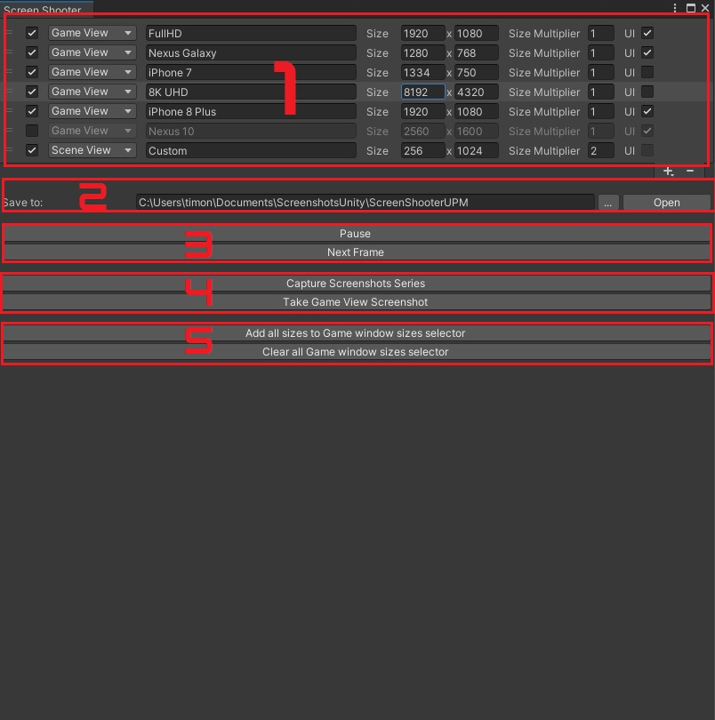
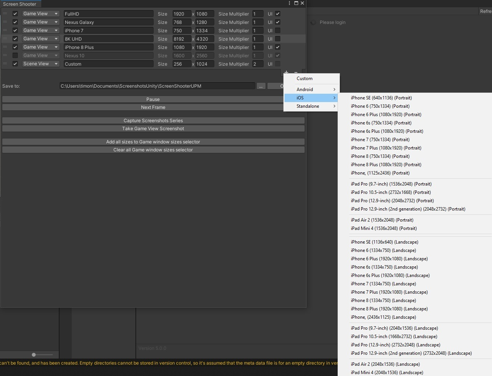

# ScreenShooter

## Description
'ScreenShooter' is an asset that can capture screenshot sequences in editor. You can configurate size, Game/Editor view and UI for screenshots.
Integrated with [Polyglot Tool](https://assetstore.unity.com/packages/tools/gui/polyglot-tool-131560?_ga=2.85337567.750031523.1612646196-741310434.1607024629) to capture screenshots with all avaliabled languages. Can work without *Polyglot* too.  
Also provide API to capture screenshots runtime  

## Editor window & how to use it
  
Here are main(and only one) screenshoter window. Open it in *Windows/ScreenShooter* or *Alt+S*.
 - 1) It's your screenshot secuence. Here you can setup this parameters:
     - checkmark is sequence enabled
	 - camera that capture screenshot(*scene* or *game view*)
	 - screenshot name
	 - screenshot size
	 - screenshot size multiplayer
	 - checkmark for capturing *world space UI*. You can't capture *UI* for *Scene View* screnshot
	 - also you can add new screenshots and remove old
	 - if you have *[Polyglot Tool](https://assetstore.unity.com/packages/tools/gui/polyglot-tool-131560?_ga=2.85337567.750031523.1612646196-741310434.1607024629)* installed it will capture each screenshot for all supported languages
 - 2) Where screenshots should be saved. Default path pretty good, but you can choose it by pressing **...**. Press on **Open** to open screenshots folder
 - 3.1) **Pause** - et timescene for zero
 - 3.2) **Next frame** - skip 1 frame
 - 4.1) **Capture screenshots series** - Capture all screenshots in sequence
 - 4.2) **Take Game view Screenshoot** - Capture single screenshot
 - 5.1) **Add all sizes to Game window sizes selector** - Add all screenshot sizes to *Game view Resolution selection*, so you can test game with them all
 - 5.2) **Clear all Game window sizes selector** - Clear *Game view Resolution selection*

---------------------

  
Asset already have defined sizes for some polular devises. You can select them, or create custom setup

---------------------

 
Here are example what buttons ** all sizes to Game window sizes selector** and **Clear all Game window sizes selector** do

## Installation
### (For Unity 2018.3 or later) Using OpenUPM  
This package is available on [OpenUPM](https://openupm.com).  
You can install it via [openupm-cli](https://github.com/openupm/openupm-cli).  
```
openupm add com.teamon.screenshooter
```

### (For Unity 2018.3 or later) Using Git
Find the manifest.json file in the Packages folder of your project and add a line to `dependencies` field.
`"com.teamon.screenshooter": "https://github.com/Team-on/UnityScreenShooter.git"`
Or, use [UpmGitExtension](https://github.com/mob-sakai/UpmGitExtension) to install and update the package.

#### For Unity 2018.2 or earlier
1. Download a source code zip this page
2. Extract it
3. Import it into the following directory in your Unity project
   - `Packages` (It works as an embedded package. For Unity 2018.1 or later)
   - `Assets` (Legacy way. For Unity 2017.1 or later)
   
#### From Unity Asset Store
1. https://assetstore.unity.com/packages/slug/188939
2. Add it to project as usual
